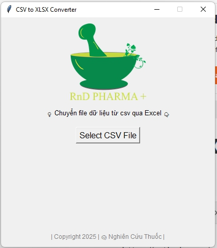

# 🧠 CSV to XLSX Converter GUI | Giao diện chuyển CSV sang Excel

> A simple desktop app to convert `.csv` files into `.xlsx` format using a friendly graphical interface.  
> Ứng dụng máy tính đơn giản giúp chuyển đổi file `.csv` sang định dạng Excel `.xlsx` bằng giao diện đồ họa dễ sử dụng.




---

## ✅ Features | Tính năng

- 📂 Select and convert `.csv` file to `.xlsx`
- 🖼️ Display logo and custom note
- 🎨 Friendly Tkinter GUI, no need for command line
- 🧪 Chọn file CSV và chuyển sang Excel (.xlsx)
- 🌿 Hiển thị logo và ghi chú bản quyền
- 👨‍💻 Không cần dùng dòng lệnh, giao diện trực quan dễ dùng

---

## 📦 Requirements | Yêu cầu

- Python >= 3.8  
- Thư viện Python:
  - `pandas`
  - `tkinter` *(built-in)*
  - `Pillow` *(for image)*

Cài nhanh:
```bash
pip install pandas pillow

## Copyright 2025 | 🧠 Nghiên Cứu Thuốc